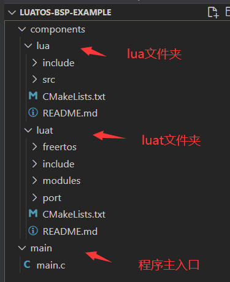
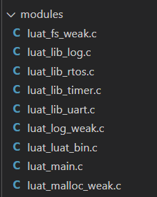
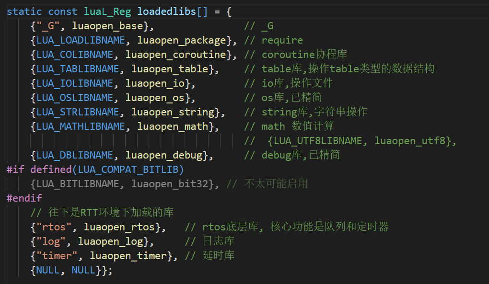
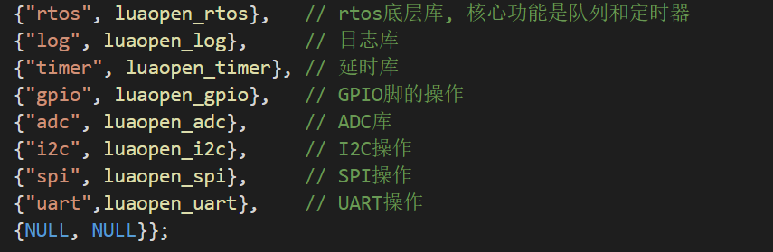

# LuatOS BSP移植教程

## 一、前言

大半年没写文字教程了，开始写这篇文章前还在犹豫要不要做，手生了，手放键盘上不知道该打啥字，本来计划做视频教程的，~~但因为经常嘴瓢~~，还是写文字吧。

LuatOS本着自身的开源特性，可以很轻松的嵌入到很多微处理器和微控制器，那就说说咋移植这套系统呗，其实并不难，看完基本就会了（大概）

目前我在做的是esp32的luatos分支，（~~只不过进度挺慢的，有空就写）~~，依照我现有的经验，搞一下基础的移植教程吧。

## 二、初探

### 提要

要想做移植，就要先了解需要移植芯片的sdk，luatos依赖于freertos/rtt这类rtos系统，如果要移植的芯片sdk中用的有rtos，那么恭喜你，可以很轻松的将luatos移植到芯片上。

我给大家准备了配套的移植模板，请根据模板看这篇移植教程

[Github](https://github.com/dreamcmi/luatos-bsp-example)

[Gitee](https://gitee.com/dreamcmi/luatos-bsp-example)

废话少说，开始进入正题

### 准备

基本步骤

1. 编译环境的集成
2. 核心功能的适配
3. 外设的适配  

看到这可能还会一脸懵逼？莫慌，听我慢慢道来。

#### 1、编译环境的集成

这一步是最开始的一步，就是将lua虚拟机部分集成进芯片，我们要做的就是Ctrl+C Ctrl+V。 

要想运行luatos，就要把核心的lua虚拟机部分集成进去，下面就开始步骤讲解。

(1)使用芯片的sdk建立一个空白的工程（这肯定都会）

(2)将luatos仓库里的lua文件夹和luat文件夹复制到新建好的工程里面




这里根据图再简要说明一下，lua文件夹里面的文件可以直接复制，luat里面要复制的有三个部分：

- （1）freertos或者rtt，这个是调用rtos的接口，如果芯片使用的是这两种直接复制就好啦,

  如果是freertos, 使用现成的 luat/freertos 目录下的代码, 否则需要实现 luat_msgbus.h 和 luat_timer.h

- （2）include文件夹，这是头文件所在的地方

- （3）modules 这个是和用户做交互用的源码所在（第一次不需要全部加入）   



第一次集成加这些就够了

luat文件夹下的ports文件夹，是做接口适配用的，下面会讲

PS：packages里面的东西，不需要在第一次编译的时候加上，后续慢慢加功能的时候加上就行。（防止编译出错）

(3)设置编译

其实就是写Makefile或者cmake  

```markdown
$LUATOS
    - lua                       # Lua虚拟机
    - luat/module               # lua库实现
    - luat/ports				# 接口层实现
```

以上目录内的.h文件需要加入include配置, .c文件加入到编译路径.

以静态库的方式编译进目标就好啦，就不详细解释了，相信看这篇文章的都会写

#### 2、核心功能是适配

这里分两部分做适配，设置主入口和base.c

(1)设置主入口

打开工程的main.c（不同芯片叫法可能不一样）

加入以下代码

```c
#include "bget.h"
#include "luat_base.h"

#define LUAT_HEAP_SIZE ()
uint8_t luavm_heap[LUAT_HEAP_SIZE] = {0};

void app_main(void)
{
    bpool(luavm_heap, LUAT_HEAP_SIZE);  
    // lua vm需要一块内存用于内部分配, 给出首地址及大小.
    luat_main();      
    // luat_main是LuatOS的主入口, 该方法通常不会返回.
}

```

这里做一下批注 #define LUAT_HEAP_SIZE () 这个定义是设置luatos可以使用的内存堆大小，这里要根据芯片可用的大小选择单位是byte

e.g. #define LUAT_HEAP_SIZE (16*1024) //代表分配16k 给luatos使用

(2) 设置base.c

这里可以根据本工程配套的示例仓库做

在ports文件夹内新建一个名为luat_base_xxx.c的文件，所有基础的实现都会在这个文件内找到。

这里说几个部分吧

- 设置加载的库

  




- 设置bsp的名称

  ```c
  const char *luat_os_bsp(void)
  {
    return "example"; //example改成芯片的名字
  }
  ```

- 设置log打印函数

  ```c
  void luat_nprint(char *s, size_t l)
  {
    printf("%s", s);
  }
  ```

  一般可以用printf()这个函数，如果芯片sdk不支持，请换成对应的或者自行实现

#### 3、开始编译

编译通过刷入芯片，打开串口就能看到luatos的log打印了

如果编译失败，请根据报错查找原因。

#### 4、FS的实现

单独把fs这一部分拿出来说一下，lua脚本是存放在fs里面的，所以说，要实现luatos正常的运行，还需要把fs做好适配

这里需要在ports文件夹内新建一个名为luat_fs_xxx.c的文件，把实现函数放在这个文件夹内

- （1）根据芯片sdk，在芯片flash中创建fs分区，常见的有spiffs、fatfs、littefs等等，关键函数是`int luat_fs_init(void)`
- （2）如果支持posix风格的,则自带实现,否则需要实现 `luat_fs.h`

## 三、进阶

外设的适配

外设通常指 `gpio`/`i2c`/`spi`, 实现对应的.h文件就可以了, 然后在`luat_openlibs`加载

加载示例`{"gpio", luaopen_gpio},`

## 四、小结

基础移植大概讲这些就够用了，基础移植成功之后，后面的就是外设的适配了，这个过程必定是漫长的，还请各位大佬耐心搞一搞，有问题可以来luatos大群1061642968探讨或者提issue。

欢迎大家批评指正，本篇教程到此结束

